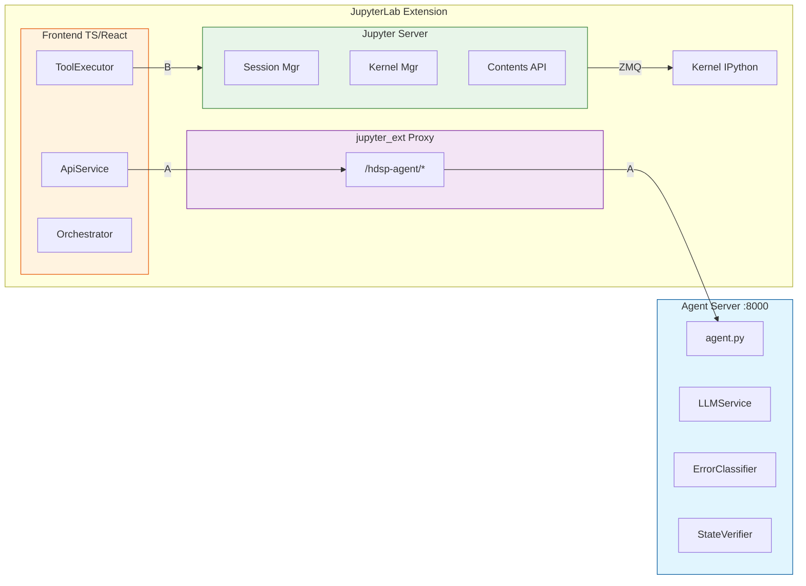
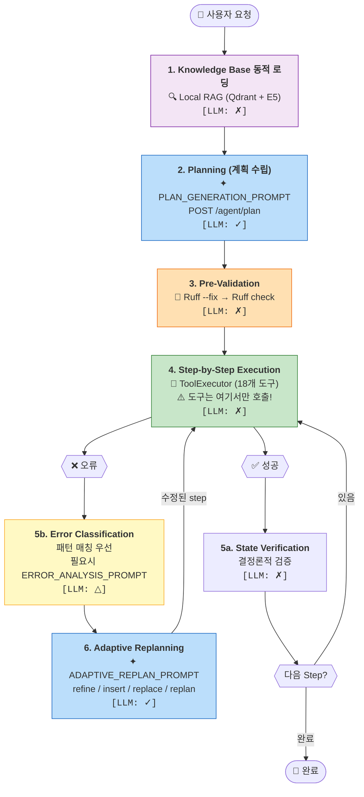
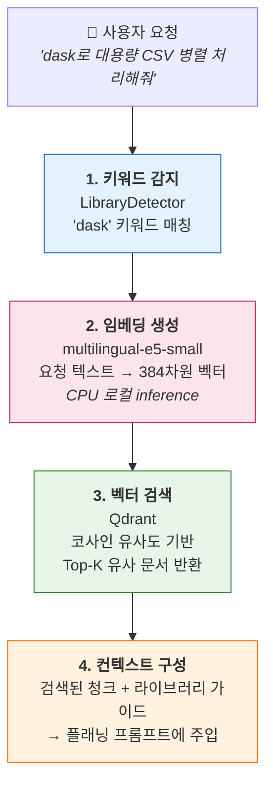
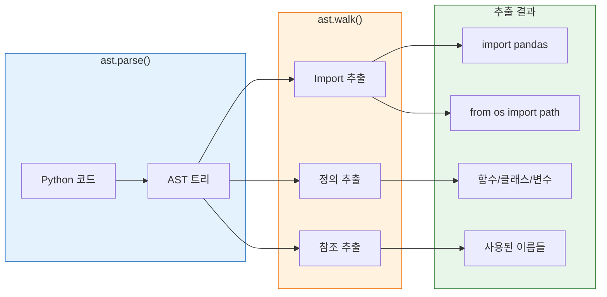
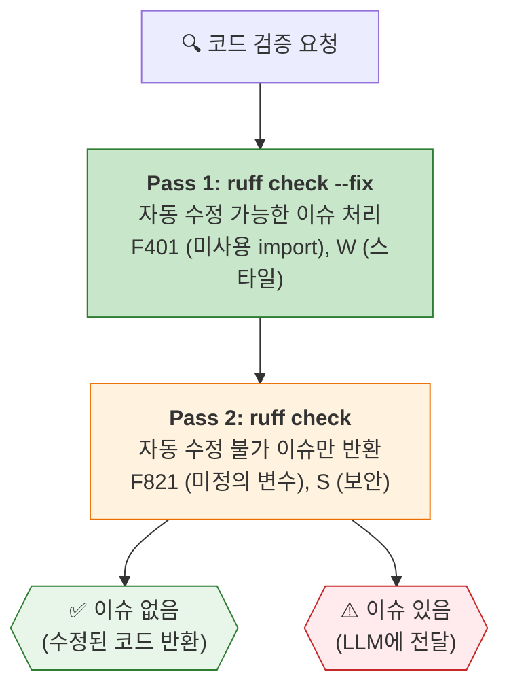
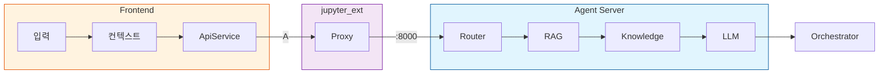
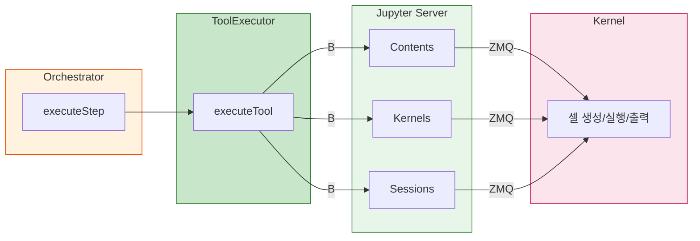

# HDSP Agent - Plan-and-Execute 아키텍처 흐름

## 개요

HDSP Agent는 HuggingFace Jupyter Agent에서 영감을 받은 **Plan-and-Execute 패턴**을 구현합니다.
사용자 요청을 받아 계획을 수립하고, 단계별로 실행하며, 오류 발생 시 적응적으로 재계획합니다.

### 아키텍처 개요

HDSP Agent는 **Agent Server 분리 아키텍처**를 채택하며, 두 가지 통신 경로 [A], [B]를 사용합니다:



> **범례**: `A` = REST API (프록시 경유), `B` = Jupyter API (직접 호출)

**통신 경로 (2가지):**
- **A. REST API (프록시 경유)**: Frontend → jupyter_ext → Agent Server → LLM
  - 용도: 계획 생성, 코드 검증, 에러 분류, 리플랜
  - 프록시 사용 이유: CORS 해결, Jupyter 세션 인증 자동 처리, Agent Server 내부망 격리
- **B. Jupyter API (직접 호출)**: ToolExecutor → Jupyter Server → Kernel
  - 용도: 셀 생성/실행, 파일 작업, 출력 캡처
  - Agent Server를 거치지 않고 직접 Jupyter Native API 사용

**설계 원칙:**
- **클라이언트-서버 분리**: Frontend는 도구 실행만, Agent Server는 LLM 호출 담당
- **API 키 보안**: 서버는 API 키를 저장하지 않음 (요청마다 클라이언트가 전송)
- **하이브리드 서브시스템**: 에러 분류는 패턴 매칭 우선, 필요시 LLM Fallback; 상태 검증은 결정론적
- **순수 프록시**: jupyter_ext는 비즈니스 로직 없이 요청만 포워딩

---

## 전체 흐름도



**범례:**
| 표시 | 의미 | 색상 |
|------|------|------|
| `[LLM: ✓]` | LLM 호출 필수 | 🔵 파란색 |
| `[LLM: △]` | 조건부 LLM (패턴 매칭 실패 시) | 🟡 노란색 |
| `[LLM: ✗]` | LLM 호출 없음 (결정론적) | 기타 |
| `✦ PROMPT_NAME` | 사용되는 프롬프트 | [상세 보기](./agent_prompts.md) |

---

## 📑 문서 목차

### 본 문서 섹션 (흐름도 1~3단계 + 아키텍처)

| # | 흐름도 단계 | 섹션 | 설명 |
|---|------------|------|------|
| 1 | 1단계 | [Knowledge Base 동적 로딩](#knowledge-base-동적-로딩-local-rag) | Local RAG, Qdrant, 임베딩 모델 |
| 2 | 2단계 | [API 엔드포인트](#api-엔드포인트) | Planning API (/agent/plan) |
| 3 | 3단계 | [Pre-Validation](#pre-validation-사전-검증) | Ruff 기반 코드 검증, 자동 수정 |
| 4 | - | [데이터 흐름](#데이터-흐름) | A/B 경로별 상세 흐름 |
| 5 | - | [핵심 파일 위치](#핵심-파일-위치) | 주요 코드 위치 |
| 6 | - | [아키텍처 특징](#아키텍처-특징) | 시스템 설계 원칙 |
| 7 | - | [참고 프로젝트](#참고-프로젝트) | 오픈소스 레퍼런스 |

### 별도 문서 (흐름도 4~6단계 + 설정)

| 흐름도 단계 | 문서 | 설명 |
|------------|------|------|
| 2, 6단계 | **[프롬프트 레퍼런스](./agent_prompts.md)** | 전체 LLM 프롬프트 발췌 및 호출 시점 |
| 4단계 | **[도구 상세](./agent_tools.md)** | 18개 도구 목록, 위험 수준, 승인 정책 |
| 5a, 5b, 6단계 | **[서브시스템 상세](./agent_subsystems.md)** | ErrorClassifier, StateVerifier, 상태 머신 |
| - | **[프로젝트 설정](./project_setup.md)** | 빌드, 실행, 테스트 전략 |

---

## Knowledge Base 동적 로딩 (Local RAG)

사용자 요청에서 특정 라이브러리 키워드를 감지하면, 해당 라이브러리의 API 가이드를 자동으로 로드합니다.

### 아키텍처



### 구성 요소

| 컴포넌트 | 기술 | 역할 |
|----------|------|------|
| **임베딩 모델** | `intfloat/multilingual-e5-small` | 텍스트 → 384차원 벡터 (한국어 지원) |
| **벡터 DB** | Qdrant (Docker 또는 In-Memory) | 벡터 저장 및 유사도 검색 |
| **문서 청킹** | LangChain RecursiveCharacterTextSplitter | 마크다운 문서 분할 (1000자, 200 overlap) |

### 임베딩 모델 상세 스펙

| 항목 | 값 |
|------|-----|
| **모델 크기** | ~470MB (float16), ~235MB (int8 양자화) |
| **벡터 차원** | 384 |
| **최대 시퀀스 길이** | 512 토큰 |
| **언어 지원** | 100+ 언어 (한국어 포함) |

### 권장 서버 스펙 (CPU 전용)

| 항목 | 최소 | 권장 |
|------|------|------|
| **CPU** | 2 cores | 4+ cores |
| **RAM** | 4GB | 8GB |
| **디스크** | 2GB | 5GB |
| **GPU** | 불필요 | 불필요 (CPU inference) |

> 📝 **참고**: 임베딩 모델은 **GPU 없이 CPU에서 실행**됩니다. 초기 모델 로드에 약 5~10초 소요되며, 이후 요청당 50~200ms의 지연시간을 보입니다.

### 지원 라이브러리

| 트리거 키워드 | 로드되는 가이드 |
|--------------|----------------|
| `dask`, `dask.dataframe`, `dd.read` | `dask.md` |
| `polars`, `pl.read` | `polars.md` |
| `pyspark`, `spark` | `pyspark.md` |
| `vaex` | `vaex.md` |
| `modin` | `modin.md` |
| `ray` | `ray.md` |

### 예시: Dask 요청 처리

```
사용자: "dask로 대용량 CSV 파일을 병렬 처리해줘"
         ↓
1. "dask" 키워드 감지
2. 요청 텍스트 임베딩 생성 (multilingual-e5-small)
3. Qdrant에서 유사 문서 청크 검색
4. dask.md 가이드 + 검색된 청크 결합
5. 플래닝 프롬프트에 컨텍스트 주입
6. LLM이 올바른 Dask 문법으로 계획 생성
```

### 코드 위치

| 파일 | 역할 |
|------|------|
| `agent-server/agent_server/knowledge/loader.py` | 지식 로더 |
| `agent-server/agent_server/rag/embedding_manager.py` | 임베딩 생성 |
| `agent-server/agent_server/rag/qdrant_manager.py` | 벡터 DB 관리 |
| `agent-server/agent_server/knowledge/libraries/*.md` | 라이브러리 가이드 |

---

## API 엔드포인트

### Agent API (`/agent/*`)

| 엔드포인트 | 메서드 | 설명 | LLM 호출 |
|------------|--------|------|----------|
| `/agent/plan` | POST | 실행 계획 생성 | ✓ |
| `/agent/refine` | POST | 코드 수정 (Self-Healing) | ✓ |
| `/agent/replan` | POST | 적응적 재계획 결정 | △ (패턴+LLM Fallback) |
| `/agent/verify-state` | POST | 상태 검증 | ✗ (결정론적) |
| `/agent/report-execution` | POST | 실행 결과 보고 | ✗ |

### Chat API (`/chat/*`)

| 엔드포인트 | 메서드 | 설명 | LLM 호출 |
|------------|--------|------|----------|
| `/chat/message` | POST | 채팅 메시지 | ✓ |
| `/chat/stream` | POST | 스트리밍 응답 (SSE) | ✓ |

### 요청 예시

```json
// POST /agent/plan
{
  "request": "pandas로 CSV 파일을 읽어서 데이터 분석해줘",
  "notebookContext": {
    "cellCount": 5,
    "importedLibraries": ["pandas", "numpy"],
    "definedVariables": ["df", "data"],
    "recentCells": [...]
  },
  "llmConfig": {
    "provider": "gemini",
    "gemini": {
      "apiKey": "AIza...",
      "model": "gemini-2.5-flash"
    }
  }
}
```

---

## Pre-Validation (사전 검증)

실행 전 코드 품질 검사를 수행합니다.

### 검증 도구 비교

| 도구 | 특징 | 검사 범위 |
|------|------|----------|
| **Ruff** | Rust 기반 초고속 린터 (700+ 규칙) | F (Pyflakes), E/W (스타일), S (보안), B (버그 패턴) |
| **AST** | Python 내장 파서 | 구문 분석, 의존성 추출 |

### Ruff 규칙 카테고리

| 규칙 코드 | 카테고리 | 설명 | 심각도 |
|----------|---------|------|--------|
| F821 | undefined_name | 미정의 변수/함수 | ERROR |
| F401 | unused_import | 미사용 import | WARNING |
| S102 | security | `exec()` 사용 감지 | WARNING |
| E9xx | syntax | 런타임 에러 | ERROR |

### AST 분석

Python 내장 `ast` 모듈로 코드를 파싱하여 의존성과 정의를 추출합니다.



**추출 항목:**

| AST 노드 | 추출 대상 | 용도 |
|----------|----------|------|
| `ast.Import`, `ast.ImportFrom` | import 문 | 라이브러리 의존성 |
| `ast.FunctionDef`, `ast.ClassDef` | 함수/클래스 정의 | 정의된 심볼 |
| `ast.Assign`, `ast.AnnAssign` | 변수 할당 | 정의된 변수 |
| `ast.Name` (Load ctx) | 이름 참조 | 사용된 심볼 |
| `ast.Attribute` | 속성 접근 | 메서드/속성 사용 |

**코드 위치:** `agent-server/agent_server/core/code_validator.py` (L253-330)

### Ruff 자동 수정 (--fix)

코드 검증 시 Ruff의 자동 수정 기능을 활용하여 LLM 토큰을 절약합니다.



**API 응답 확장:**
```python
class ValidateResponse:
    valid: bool                     # 검증 통과 여부
    issues: List[ValidationIssue]   # 자동 수정 불가 이슈
    fixedCode: Optional[str]        # 자동 수정된 코드 (NEW)
    fixedCount: int                 # 자동 수정된 이슈 수 (NEW)
```

**효과:**
- 스타일/포맷팅 이슈는 LLM 호출 없이 즉시 수정
- LLM에 전달되는 이슈 수 감소 → 토큰 절약
- 응답 속도 향상

**코드 위치:** `agent-server/agent_server/core/code_validator.py`

---

## 데이터 흐름

### A. 계획 생성 흐름 (REST API 경유)



> **상세**: 입력(AutoAgentPanel) → 컨텍스트(ContextManager) → API → Proxy(handlers.py) → Router(agent.py) → RAG(임베딩+검색) → Knowledge(loader.py) → LLM(llm_service.py) → 계획 반환

### B. 도구 실행 흐름 (Jupyter API)



> **상세**: Orchestrator.executeStep() → ToolExecutor.executeTool() → Jupyter API (Contents/Kernels/Sessions) → ZMQ → Kernel (insertCell, run, outputs)

---

## 핵심 파일 위치

### Agent Server

| 컴포넌트 | 파일 경로 |
|----------|----------|
| API 라우터 | `agent-server/agent_server/routers/agent.py` |
| Chat 라우터 | `agent-server/agent_server/routers/chat.py` |
| 프롬프트 템플릿 | `agent-server/agent_server/prompts/auto_agent_prompts.py` |
| Knowledge Base | `agent-server/agent_server/knowledge/loader.py` |
| 라이브러리 가이드 | `agent-server/agent_server/knowledge/libraries/*.md` |
| 코드 검증기 | `agent-server/agent_server/core/code_validator.py` |
| 에러 분류기 | `agent-server/agent_server/core/error_classifier.py` |
| 상태 검증기 | `agent-server/agent_server/core/state_verifier.py` |
| LLM 서비스 | `agent-server/agent_server/core/llm_service.py` |

### Frontend (JupyterLab Extension)

| 컴포넌트 | 파일 경로 |
|----------|----------|
| API 서비스 | `extensions/jupyter/frontend/services/ApiService.ts` |
| API 키 관리 | `extensions/jupyter/frontend/services/ApiKeyManager.ts` |
| 오케스트레이터 | `extensions/jupyter/frontend/services/AgentOrchestrator.ts` |
| 도구 실행기 | `extensions/jupyter/frontend/services/ToolExecutor.ts` |
| 체크포인트 관리 | `extensions/jupyter/frontend/services/CheckpointManager.ts` |
| 컨텍스트 관리 | `extensions/jupyter/frontend/services/ContextManager.ts` |
| 타입 정의 | `extensions/jupyter/frontend/types/agent.ts` |

---

## 아키텍처 특징

1. **Self-Healing**: 오류 발생 시 자동으로 코드 수정 시도
2. **Context-Aware**: 노트북 상태를 지속적으로 추적
3. **Knowledge-Enhanced**: 라이브러리별 전문 지식 동적 로딩
4. **Fail-Fast Validation**: 실행 전 코드 품질 사전 검증 + Ruff 자동 수정
5. **Adaptive Planning**: 상황에 따른 유연한 계획 수정
6. **Deterministic Subsystems**: 에러 분류/상태 검증은 LLM 없이 처리
7. **LLM Fallback**: 패턴 매칭 실패 시 LLM 기반 에러 분석
8. **Extended Toolset**: 18개 내장 도구 (파일, 셸, Git, 테스트, 리팩토링 등)
9. **Rate Limit Resilience**: 자동 API 키 교체로 서비스 연속성 보장

---

## 참고 프로젝트

개발 과정에서 다음 오픈소스 프로젝트를 참고했습니다:
- [Roo Code](https://github.com/RooVetGit/Roo-Code)
- [Cline](https://github.com/cline/cline)
- [Continue](https://github.com/continuedev/continue)
- [Void](https://github.com/voideditor/void)
