# HDSP Agent - Plan-and-Execute 아키텍처 흐름

## 개요

HDSP Agent는 HuggingFace Jupyter Agent에서 영감을 받은 **Plan-and-Execute 패턴**을 구현합니다.
사용자 요청을 받아 계획을 수립하고, 단계별로 실행하며, 오류 발생 시 적응적으로 재계획합니다.

### 아키텍처 개요

HDSP Agent는 **Agent Server 분리 아키텍처**를 채택하며, 두 가지 통신 경로 [A], [B]를 사용합니다:


> **범례**: `A` = REST API (프록시 경유), `B` = Jupyter API (직접 호출)

**통신 경로 (2가지):**
- **A. REST API (프록시 경유)**: Frontend → jupyter_ext → Agent Server → LLM
  - 용도: 계획 생성, 코드 검증, 에러 분류, 리플랜
  - 프록시 사용 이유: CORS 해결, Jupyter 세션 인증 자동 처리, Agent Server 내부망 격리
- **B. Jupyter API (직접 호출)**: ToolExecutor → Jupyter Server → Kernel
  - 용도: 셀 생성/실행, 파일 작업, 출력 캡처
  - Agent Server를 거치지 않고 직접 Jupyter Native API 사용

**설계 원칙:**
- **클라이언트-서버 분리**: Frontend는 도구 실행만, Agent Server는 LLM 호출 담당
- **API 키 보안**: 서버는 API 키를 저장하지 않음 (요청마다 클라이언트가 전송)
- **하이브리드 서브시스템**: 에러 분류는 패턴 매칭 우선, 필요시 LLM Fallback; 상태 검증은 결정론적
- **순수 프록시**: jupyter_ext는 비즈니스 로직 없이 요청만 포워딩

---

## 전체 흐름도

```mermaid
flowchart TD
    Start([🎯 사용자 요청])
    Start --> Planning

    Planning["<b>1. Planning (계획 수립)</b><br/>✦ PLAN_GENERATION_PROMPT<br/>+ Collection TOC (문서 목차만)<br/>POST /agent/plan<br/><code>[LLM: ✓]</code>"]
    Planning --> StepLoop

    subgraph StepLoop["2. Step-by-Step Execution"]
        direction TB
        RAG["<b>2a. Step-Level RAG</b><br/>POST /rag/step-context<br/>requiredCollections 기반 검색<br/><code>[LLM: ✗]</code>"]
        RAG --> CodeGen

        CodeGen["<b>2b. Code Generation</b><br/>✦ STEP_CODE_GENERATION_PROMPT<br/>POST /agent/step-code<br/><code>[LLM: ✓]</code>"]
        CodeGen --> Validation

        Validation["<b>2c. Pre-Validation</b><br/>🔧 Ruff --fix → Ruff check<br/><code>[LLM: ✗]</code>"]
        Validation --> Execution

        Execution["<b>2d. Execution</b><br/>🔧 ToolExecutor<br/><code>[LLM: ✗]</code>"]
    end

    Execution --> Success
    Execution --> Error

    Success{{"✅ 성공"}}
    Error{{"❌ 오류"}}

    Success --> StateVerify["<b>3a. State Verification</b><br/>결정론적 검증<br/><code>[LLM: ✗]</code>"]
    Error --> ErrorClass["<b>3b. Error Classification</b><br/>패턴 매칭 우선<br/>필요시 ERROR_ANALYSIS_PROMPT<br/><code>[LLM: △]</code>"]

    ErrorClass --> Replan["<b>4. Adaptive Replanning</b><br/>✦ ADAPTIVE_REPLAN_PROMPT<br/>refine / insert / replace / replan<br/><code>[LLM: ✓]</code>"]

    Replan -->|"수정된 step"| StepLoop
    StateVerify --> NextStep{{"다음 Step?"}}
    NextStep -->|"있음"| StepLoop
    NextStep -->|"완료"| End([🏁 완료])

    %% Styling
    style Planning fill:#bbdefb,stroke:#1565c0
    style CodeGen fill:#bbdefb,stroke:#1565c0
    style Replan fill:#bbdefb,stroke:#1565c0
    style ErrorClass fill:#fff9c4,stroke:#f9a825
    style Execution fill:#c8e6c9,stroke:#2e7d32
    style RAG fill:#f3e5f5,stroke:#7b1fa2
    style Validation fill:#ffe0b2,stroke:#ef6c00
```



**범례:**
| 표시 | 의미 | 색상 |
|------|------|------|
| `[LLM: ✓]` | LLM 호출 필수 | 🔵 파란색 |
| `[LLM: △]` | 조건부 LLM (패턴 매칭 실패 시) | 🟡 노란색 |
| `[LLM: ✗]` | LLM 호출 없음 (결정론적) | 기타 |
| `✦ PROMPT_NAME` | 사용되는 프롬프트 | [상세 보기](./agent_prompts.md) |

---

## 📑 문서 목차

### 본 문서 섹션 (흐름도 1~3단계 + 아키텍처)

| # | 흐름도 단계 | 섹션 | 설명 |
|---|------------|------|------|
| 1 | 1단계 | [Knowledge Base 동적 로딩](#knowledge-base-동적-로딩-local-rag) | Local RAG, Qdrant, 임베딩 모델 |
| 2 | 2단계 | [API 엔드포인트](#api-엔드포인트) | Planning API (/agent/plan) |
| 3 | 3단계 | [Pre-Validation](#pre-validation-사전-검증) | Ruff 기반 코드 검증, 자동 수정 |
| 4 | - | [데이터 흐름](#데이터-흐름) | A/B 경로별 상세 흐름 |
| 5 | - | [핵심 파일 위치](#핵심-파일-위치) | 주요 코드 위치 |
| 6 | - | [아키텍처 특징](#아키텍처-특징) | 시스템 설계 원칙 |
| 7 | - | [참고 프로젝트](#참고-프로젝트) | 오픈소스 레퍼런스 |

### 별도 문서 (흐름도 4~6단계 + 설정)

| 흐름도 단계 | 문서 | 설명 |
|------------|------|------|
| 2, 6단계 | **[프롬프트 레퍼런스](./agent_prompts.md)** | 전체 LLM 프롬프트 발췌 및 호출 시점 |
| 4단계 | **[도구 상세](./agent_tools.md)** | 18개 도구 목록, 위험 수준, 승인 정책 |
| 5a, 5b, 6단계 | **[서브시스템 상세](./agent_subsystems.md)** | ErrorClassifier, StateVerifier, 상태 머신 |
| - | **[프로젝트 설정](./project_setup.md)** | 빌드, 실행, 테스트 전략 |

---

## Knowledge Base (Step-Level RAG)

Step-Level RAG 아키텍처를 사용하여 **계획 단계에서는 문서 목차(TOC)만 제공**하고, **실제 문서 검색은 각 Step 실행 직전**에 수행합니다.

### 핵심 설계 원칙

| 단계 | RAG 사용 | 제공되는 정보 |
|------|----------|--------------|
| **Planning** | ❌ 없음 | Collection TOC (목차만) |
| **Step Execution** | ✅ 있음 | requiredCollections 기반 문서 검색 |

**장점:**
- 계획 단계에서 불필요한 문서 로딩 방지 (토큰 절약)
- 각 Step에 필요한 문서만 정확히 검색 (정밀도 향상)
- LLM이 어떤 문서가 필요한지 직접 결정 (`requiredCollections`)

### 아키텍처

```mermaid
flowchart TD
    subgraph Planning["1. Planning Phase (NO RAG)"]
        Request["📝 사용자 요청<br/><i>'dask로 대용량 CSV 병렬 처리해줘'</i>"]
        Request --> TOC["<b>Collection TOC 로드</b><br/>collection_index.yaml<br/>문서 목록/설명만 제공"]
        TOC --> Plan["<b>LLM Planning</b><br/>각 Step에 requiredCollections 지정<br/><code>toolCalls는 placeholder</code>"]
    end

    Plan --> StepExec

    subgraph StepExec["2. Step Execution (per-step RAG)"]
        RAG["<b>Step-Level RAG</b><br/>POST /rag/step-context<br/>requiredCollections 기반 검색"]
        RAG --> CodeGen["<b>코드 생성</b><br/>POST /agent/step-code<br/>RAG context + step description"]
        CodeGen --> Execute["<b>실행</b><br/>ToolExecutor"]
    end

    style Planning fill:#e3f2fd,stroke:#1565c0
    style StepExec fill:#e8f5e9,stroke:#2e7d32
    style RAG fill:#f3e5f5,stroke:#7b1fa2
    style CodeGen fill:#bbdefb,stroke:#1565c0
```



### Collection Index (TOC)

Planning 단계에서 LLM에 제공되는 문서 목차입니다. **실제 문서 내용은 포함하지 않고** 어떤 Collection이 있는지만 알려줍니다.

**파일 위치:** `hdsp_agent_core/knowledge/collection_index.yaml`

```yaml
# 예시
collections:
  - name: "dask"
    display_name: "Dask DataFrame"
    description: "대용량 데이터 처리, 분산 컴퓨팅, lazy evaluation"
    key_topics: ["dd.read_csv", "compute()", "distributed"]
    use_cases: ["메모리 초과 데이터", "병렬 처리"]

  - name: "matplotlib"
    display_name: "Matplotlib Visualization"
    description: "데이터 시각화, 차트, 그래프"
    key_topics: ["plt.figure", "한글 폰트", "차트 종류"]
    use_cases: ["시각화", "EDA"]
```

**LLM에 주입되는 형식:**
```markdown
## 📚 Available Knowledge Collections

각 step에서 필요한 collection을 `requiredCollections`에 지정하세요:

### Dask DataFrame (`dask`)
- **설명**: 대용량 데이터 처리, 분산 컴퓨팅
- **주요 API**: dd.read_csv, compute()
- **사용 시**: 메모리 초과 데이터, 병렬 처리

### Matplotlib Visualization (`matplotlib`)
...
```

### Step Schema: requiredCollections

Planning 단계에서 LLM이 각 Step에 필요한 Collection을 지정합니다.

```json
{
  "plan": {
    "steps": [
      {
        "stepNumber": 1,
        "description": "Dask로 대용량 CSV 파일 로드",
        "toolCalls": [{"tool": "jupyter_cell", "parameters": {"code": "# placeholder"}}],
        "requiredCollections": ["dask"]
      },
      {
        "stepNumber": 2,
        "description": "데이터 시각화",
        "toolCalls": [{"tool": "jupyter_cell", "parameters": {"code": "# placeholder"}}],
        "requiredCollections": ["matplotlib"]
      }
    ]
  }
}
```

> **Note:** `toolCalls.code`는 placeholder입니다. 실제 코드는 Step 실행 시 RAG 컨텍스트와 함께 생성됩니다.

### Step Execution Flow

각 Step 실행 전 수행되는 RAG + 코드 생성 흐름:

```
Step 1: "Dask로 대용량 CSV 로드" (requiredCollections: ["dask"])
  ↓
1. POST /rag/step-context
   - query: "Dask로 대용량 CSV 로드"
   - collections: ["dask"]
   → context: dask.md의 관련 청크들
  ↓
2. POST /agent/step-code
   - step description + RAG context + notebook context
   → final toolCalls (실제 Python 코드)
  ↓
3. ToolExecutor.executeTool()
   - 생성된 코드 실행
```

### 구성 요소

| 컴포넌트 | 기술 | 역할 |
|----------|------|------|
| **Collection Index** | YAML | Planning용 문서 목차 (TOC) |
| **임베딩 모델** | `intfloat/multilingual-e5-small` | 텍스트 → 384차원 벡터 (한국어 지원) |
| **벡터 DB** | Qdrant (Docker 또는 In-Memory) | 벡터 저장 및 유사도 검색 |
| **문서 청킹** | LangChain RecursiveCharacterTextSplitter | 마크다운 문서 분할 (1000자, 200 overlap) |

### 임베딩 모델 상세 스펙

| 항목 | 값 |
|------|-----|
| **모델 크기** | ~470MB (float16), ~235MB (int8 양자화) |
| **벡터 차원** | 384 |
| **최대 시퀀스 길이** | 512 토큰 |
| **언어 지원** | 100+ 언어 (한국어 포함) |

### 권장 서버 스펙 (CPU 전용)

| 항목 | 최소 | 권장 |
|------|------|------|
| **CPU** | 2 cores | 4+ cores |
| **RAM** | 4GB | 8GB |
| **디스크** | 2GB | 5GB |
| **GPU** | 불필요 | 불필요 (CPU inference) |

> 📝 **참고**: 임베딩 모델은 **GPU 없이 CPU에서 실행**됩니다. 초기 모델 로드에 약 5~10초 소요되며, 이후 요청당 50~200ms의 지연시간을 보입니다.

### 지원 Collection

| Collection 이름 | 설명 | 주요 API |
|----------------|------|----------|
| `dask` | 대용량 데이터 처리, 분산 컴퓨팅 | `dd.read_csv`, `compute()` |
| `polars` | 고성능 DataFrame, Rust 기반 | `pl.read_csv`, Expression API |
| `pyspark` | 분산 데이터 처리, Spark DataFrame | `SparkSession`, `spark.read` |
| `vaex` | Out-of-core DataFrame, 메모리 효율 | `vaex.open`, lazy expressions |
| `modin` | Pandas 가속화, 멀티코어 활용 | `modin.pandas`, ray backend |
| `ray` | 분산 컴퓨팅 프레임워크 | `ray.init`, `@ray.remote` |
| `matplotlib` | 데이터 시각화, 차트 | `plt.figure`, 한글 폰트 |

### 코드 위치

| 파일 | 역할 |
|------|------|
| `hdsp_agent_core/knowledge/collection_index.yaml` | Collection 목차 정의 |
| `hdsp_agent_core/knowledge/collection_index.py` | TOC 로더 클래스 |
| `agent-server/routers/rag.py` | `/rag/step-context` 엔드포인트 |
| `agent-server/routers/agent.py` | `/agent/step-code` 엔드포인트 |
| `agent-server/core/rag_manager.py` | RAG 검색 관리 |
| `hdsp_agent_core/knowledge/libraries/*.md` | 라이브러리 API 가이드 |

---

## API 엔드포인트

### Agent API (`/agent/*`)

| 엔드포인트 | 메서드 | 설명 | LLM 호출 |
|------------|--------|------|----------|
| `/agent/plan` | POST | 실행 계획 생성 (Collection TOC 포함) | ✓ |
| `/agent/step-code` | POST | **Step-Level 코드 생성 (RAG context 기반)** | ✓ |
| `/agent/refine` | POST | 코드 수정 (Self-Healing) | ✓ |
| `/agent/replan` | POST | 적응적 재계획 결정 | △ (패턴+LLM Fallback) |
| `/agent/verify-state` | POST | 상태 검증 | ✗ (결정론적) |
| `/agent/report-execution` | POST | 실행 결과 보고 | ✗ |

### RAG API (`/rag/*`)

| 엔드포인트 | 메서드 | 설명 | LLM 호출 |
|------------|--------|------|----------|
| `/rag/step-context` | POST | **Step-Level RAG 컨텍스트 조회** | ✗ |
| `/rag/search` | POST | 명시적 RAG 검색 | ✗ |
| `/rag/status` | GET | RAG 시스템 상태 | ✗ |
| `/rag/debug` | POST | RAG 검색 디버깅 (리니지 추적) | ✗ |

### Chat API (`/chat/*`)

| 엔드포인트 | 메서드 | 설명 | LLM 호출 |
|------------|--------|------|----------|
| `/chat/message` | POST | 채팅 메시지 | ✓ |
| `/chat/stream` | POST | 스트리밍 응답 (SSE) | ✓ |

### 요청 예시

```json
// POST /agent/plan - 계획 생성 (Collection TOC 포함, RAG 없음)
{
  "request": "dask로 대용량 CSV 파일을 병렬 처리하고 시각화해줘",
  "notebookContext": {
    "cellCount": 5,
    "importedLibraries": ["pandas", "numpy"],
    "definedVariables": ["df", "data"],
    "recentCells": [...]
  },
  "llmConfig": {
    "provider": "gemini",
    "gemini": {
      "apiKey": "AIza...",
      "model": "gemini-2.5-flash"
    }
  }
}

// 응답: requiredCollections가 포함된 계획
{
  "plan": {
    "steps": [
      {
        "stepNumber": 1,
        "description": "Dask로 대용량 CSV 파일 로드",
        "toolCalls": [{"tool": "jupyter_cell", "parameters": {"code": "# placeholder"}}],
        "requiredCollections": ["dask"]
      },
      {
        "stepNumber": 2,
        "description": "데이터 시각화",
        "toolCalls": [{"tool": "jupyter_cell", "parameters": {"code": "# placeholder"}}],
        "requiredCollections": ["matplotlib"]
      }
    ]
  }
}
```

```json
// POST /rag/step-context - Step-Level RAG 컨텍스트 조회
{
  "query": "Dask로 대용량 CSV 파일 로드",
  "collections": ["dask"],
  "topK": 3
}

// 응답: 검색된 문서 컨텍스트
{
  "context": "### DASK API Guide\n\ndd.read_csv()를 사용하여...",
  "sources": ["dask"],
  "chunkCount": 3
}
```

```json
// POST /agent/step-code - Step-Level 코드 생성
{
  "step": {
    "stepNumber": 1,
    "description": "Dask로 대용량 CSV 파일 로드",
    "toolCalls": [{"tool": "jupyter_cell", "parameters": {"code": "# placeholder"}}],
    "requiredCollections": ["dask"]
  },
  "ragContext": "### DASK API Guide\n\ndd.read_csv()를 사용하여...",
  "notebookContext": {
    "cellCount": 5,
    "importedLibraries": ["pandas"],
    "definedVariables": []
  },
  "llmConfig": { ... }
}

// 응답: 실제 코드가 포함된 toolCalls
{
  "toolCalls": [
    {
      "tool": "jupyter_cell",
      "parameters": {
        "code": "import dask.dataframe as dd\n\n# 대용량 CSV 파일 로드\ndf = dd.read_csv('data/*.csv')\ndf.head()"
      }
    }
  ]
}
```

---

## Pre-Validation (사전 검증)

실행 전 코드 품질 검사를 수행합니다.

### 검증 도구 비교

| 도구 | 특징 | 검사 범위 |
|------|------|----------|
| **Ruff** | Rust 기반 초고속 린터 (700+ 규칙) | F (Pyflakes), E/W (스타일), S (보안), B (버그 패턴) |
| **AST** | Python 내장 파서 | 구문 분석, 의존성 추출 |

### Ruff 규칙 카테고리

| 규칙 코드 | 카테고리 | 설명 | 심각도 |
|----------|---------|------|--------|
| F821 | undefined_name | 미정의 변수/함수 | ERROR |
| F401 | unused_import | 미사용 import | WARNING |
| S102 | security | `exec()` 사용 감지 | WARNING |
| E9xx | syntax | 런타임 에러 | ERROR |

### AST 분석

Python 내장 `ast` 모듈로 코드를 파싱하여 의존성과 정의를 추출합니다.

```mermaid
flowchart LR
    subgraph Parse["ast.parse()"]
        Code["Python 코드"] --> Tree["AST 트리"]
    end

    subgraph Walk["ast.walk()"]
        Tree --> Imports["Import 추출"]
        Tree --> Defs["정의 추출"]
        Tree --> Refs["참조 추출"]
    end

    subgraph Extract["추출 결과"]
        Imports --> I1["import pandas"]
        Imports --> I2["from os import path"]
        Defs --> D1["함수/클래스/변수"]
        Refs --> R1["사용된 이름들"]
    end

    style Parse fill:#e3f2fd,stroke:#1565c0
    style Walk fill:#fff3e0,stroke:#ef6c00
    style Extract fill:#e8f5e9,stroke:#2e7d32
```



**추출 항목:**

| AST 노드 | 추출 대상 | 용도 |
|----------|----------|------|
| `ast.Import`, `ast.ImportFrom` | import 문 | 라이브러리 의존성 |
| `ast.FunctionDef`, `ast.ClassDef` | 함수/클래스 정의 | 정의된 심볼 |
| `ast.Assign`, `ast.AnnAssign` | 변수 할당 | 정의된 변수 |
| `ast.Name` (Load ctx) | 이름 참조 | 사용된 심볼 |
| `ast.Attribute` | 속성 접근 | 메서드/속성 사용 |

**코드 위치:** `agent-server/agent_server/core/code_validator.py` (L253-330)

### Ruff 자동 수정 (--fix)

코드 검증 시 Ruff의 자동 수정 기능을 활용하여 LLM 토큰을 절약합니다.

```mermaid
flowchart TD
    Request["🔍 코드 검증 요청"]
    Request --> Pass1

    Pass1["<b>Pass 1: ruff check --fix</b><br/>자동 수정 가능한 이슈 처리<br/>F401 (미사용 import), W (스타일)"]
    Pass1 --> Pass2

    Pass2["<b>Pass 2: ruff check</b><br/>자동 수정 불가 이슈만 반환<br/>F821 (미정의 변수), S (보안)"]

    Pass2 --> NoIssue
    Pass2 --> HasIssue

    NoIssue{{"✅ 이슈 없음<br/>(수정된 코드 반환)"}}
    HasIssue{{"⚠️ 이슈 있음<br/>(LLM에 전달)"}}

    style Pass1 fill:#c8e6c9,stroke:#2e7d32
    style Pass2 fill:#fff3e0,stroke:#ef6c00
    style NoIssue fill:#e8f5e9,stroke:#2e7d32
    style HasIssue fill:#ffebee,stroke:#c62828
```



**API 응답 확장:**
```python
class ValidateResponse:
    valid: bool                     # 검증 통과 여부
    issues: List[ValidationIssue]   # 자동 수정 불가 이슈
    fixedCode: Optional[str]        # 자동 수정된 코드 (NEW)
    fixedCount: int                 # 자동 수정된 이슈 수 (NEW)
```

**효과:**
- 스타일/포맷팅 이슈는 LLM 호출 없이 즉시 수정
- LLM에 전달되는 이슈 수 감소 → 토큰 절약
- 응답 속도 향상

**코드 위치:** `agent-server/agent_server/core/code_validator.py`

---

## 데이터 흐름

### A. 계획 생성 흐름 (NO RAG, TOC만 사용)

```mermaid
flowchart LR
    subgraph Frontend["Frontend"]
        Input["입력"] --> Context["컨텍스트"] --> Api["ApiService"]
    end

    subgraph Proxy["jupyter_ext"]
        Handler["Proxy"]
    end

    subgraph Server["Agent Server"]
        Router["Router"] --> TOC["Collection TOC"] --> LLM["LLM"]
    end

    Api -->|"A"| Handler -->|":8000"| Router
    LLM --> Return["Orchestrator"]

    style Frontend fill:#fff3e0,stroke:#e65100
    style Proxy fill:#f3e5f5,stroke:#7b1fa2
    style Server fill:#e1f5fe,stroke:#01579b
    style TOC fill:#f3e5f5,stroke:#7b1fa2
```



> **상세**: 입력(AutoAgentPanel) → 컨텍스트(ContextManager) → API → Proxy → Router(agent.py) → **Collection TOC 로드 (RAG 없음)** → LLM → 계획 반환 (각 Step에 `requiredCollections` 포함)

### B. Step-Level RAG + 코드 생성 흐름

```mermaid
flowchart LR
    subgraph Orch["Orchestrator"]
        Step["executeStepWithRetry"]
    end

    subgraph AgentServer["Agent Server"]
        RAG["RAG<br/>/rag/step-context"]
        CodeGen["코드 생성<br/>/agent/step-code"]
    end

    Step -->|"1. requiredCollections"| RAG
    RAG -->|"2. context"| Step
    Step -->|"3. context + step"| CodeGen
    CodeGen -->|"4. toolCalls"| Step

    style Orch fill:#fff3e0,stroke:#e65100
    style RAG fill:#f3e5f5,stroke:#7b1fa2
    style CodeGen fill:#bbdefb,stroke:#1565c0
```



> **상세**: Step 실행 전 → `requiredCollections` 확인 → `/rag/step-context` (RAG 검색) → `/agent/step-code` (LLM 코드 생성) → 생성된 코드로 toolCalls 교체 → 실행

### C. 도구 실행 흐름 (Jupyter API)

```mermaid
flowchart LR
    subgraph Orch["Orchestrator"]
        Execute["executeStep"]
    end

    subgraph ToolExec["ToolExecutor"]
        Tool["executeTool"]
    end

    subgraph JupyterServer["Jupyter Server"]
        Contents["Contents"]
        Kernels["Kernels"]
        Sessions["Sessions"]
    end

    subgraph Kernel["Kernel"]
        Cell["셀 생성/실행/출력"]
    end

    Execute --> Tool
    Tool -->|"B"| Contents & Kernels & Sessions
    Contents & Kernels & Sessions -->|"ZMQ"| Cell

    style Orch fill:#fff3e0,stroke:#e65100
    style ToolExec fill:#c8e6c9,stroke:#2e7d32
    style JupyterServer fill:#e8f5e9,stroke:#2e7d32
    style Kernel fill:#fce4ec,stroke:#c2185b
```



> **상세**: Orchestrator.executeStep() → ToolExecutor.executeTool() → Jupyter API (Contents/Kernels/Sessions) → ZMQ → Kernel (insertCell, run, outputs)

---

## 핵심 파일 위치

### Agent Server

| 컴포넌트 | 파일 경로 |
|----------|----------|
| API 라우터 | `agent-server/agent_server/routers/agent.py` |
| Chat 라우터 | `agent-server/agent_server/routers/chat.py` |
| 프롬프트 템플릿 | `agent-server/agent_server/prompts/auto_agent_prompts.py` |
| Knowledge Base | `agent-server/agent_server/knowledge/loader.py` |
| 라이브러리 가이드 | `agent-server/agent_server/knowledge/libraries/*.md` |
| 코드 검증기 | `agent-server/agent_server/core/code_validator.py` |
| 에러 분류기 | `agent-server/agent_server/core/error_classifier.py` |
| 상태 검증기 | `agent-server/agent_server/core/state_verifier.py` |
| LLM 서비스 | `agent-server/agent_server/core/llm_service.py` |

### Frontend (JupyterLab Extension)

| 컴포넌트 | 파일 경로 |
|----------|----------|
| API 서비스 | `extensions/jupyter/frontend/services/ApiService.ts` |
| API 키 관리 | `extensions/jupyter/frontend/services/ApiKeyManager.ts` |
| 오케스트레이터 | `extensions/jupyter/frontend/services/AgentOrchestrator.ts` |
| 도구 실행기 | `extensions/jupyter/frontend/services/ToolExecutor.ts` |
| 체크포인트 관리 | `extensions/jupyter/frontend/services/CheckpointManager.ts` |
| 컨텍스트 관리 | `extensions/jupyter/frontend/services/ContextManager.ts` |
| 타입 정의 | `extensions/jupyter/frontend/types/agent.ts` |

---

## 아키텍처 특징

1. **Self-Healing**: 오류 발생 시 자동으로 코드 수정 시도
2. **Context-Aware**: 노트북 상태를 지속적으로 추적
3. **Step-Level RAG**: 계획 단계에서는 문서 목차(TOC)만, 실행 시 필요한 문서만 검색 (토큰 절약, 정밀도 향상)
4. **Fail-Fast Validation**: 실행 전 코드 품질 사전 검증 + Ruff 자동 수정
5. **Adaptive Planning**: 상황에 따른 유연한 계획 수정
6. **Deterministic Subsystems**: 에러 분류/상태 검증은 LLM 없이 처리
7. **LLM Fallback**: 패턴 매칭 실패 시 LLM 기반 에러 분석
8. **Extended Toolset**: 18개 내장 도구 (파일, 셸, Git, 테스트, 리팩토링 등)
9. **Rate Limit Resilience**: 자동 API 키 교체로 서비스 연속성 보장
10. **Deferred Code Generation**: Planning 시 placeholder, Step 실행 시 RAG 컨텍스트로 실제 코드 생성

---

## 참고 프로젝트

개발 과정에서 다음 오픈소스 프로젝트를 참고했습니다:
- [Roo Code](https://github.com/RooVetGit/Roo-Code)
- [Cline](https://github.com/cline/cline)
- [Continue](https://github.com/continuedev/continue)
- [Void](https://github.com/voideditor/void)
