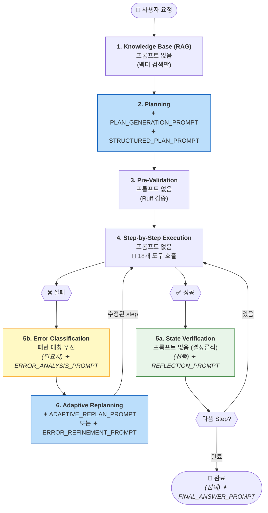

# HDSP Agent - 프롬프트 레퍼런스

본 문서는 HDSP Agent에서 사용하는 모든 LLM 프롬프트를 정리합니다.
**원본 프롬프트는 GitHub 링크를 통해 직접 확인할 수 있습니다.**

← [메인 문서로 돌아가기](./agent_planning_flow.md)

---

## 📑 프롬프트 목록

| # | 프롬프트 | 용도 | 호출 시점 | 소스 코드 |
|---|----------|------|----------|-----------|
| 1 | PLAN_GENERATION_PROMPT | 사용자 요청 → 실행 계획 | POST /agent/plan | [📄 L52](https://github.com/lks21c/hdsp_agent/blob/feature/local_rag/agent-server/agent_server/prompts/auto_agent_prompts.py#L52) |
| 2 | STRUCTURED_PLAN_PROMPT | 체계적 분석 기반 계획 | Enhanced Planning | [📄 L555](https://github.com/lks21c/hdsp_agent/blob/feature/local_rag/agent-server/agent_server/prompts/auto_agent_prompts.py#L555) |
| 3 | CODE_GENERATION_PROMPT | 단일 셀 코드 생성 | 개별 코드 요청 | [📄 L106](https://github.com/lks21c/hdsp_agent/blob/feature/local_rag/agent-server/agent_server/prompts/auto_agent_prompts.py#L106) |
| 4 | ERROR_REFINEMENT_PROMPT | 에러 발생 시 코드 수정 | POST /agent/refine | [📄 L148](https://github.com/lks21c/hdsp_agent/blob/feature/local_rag/agent-server/agent_server/prompts/auto_agent_prompts.py#L148) |
| 5 | ADAPTIVE_REPLAN_PROMPT | 복구 전략 결정 | POST /agent/replan | [📄 L232](https://github.com/lks21c/hdsp_agent/blob/feature/local_rag/agent-server/agent_server/prompts/auto_agent_prompts.py#L232) |
| 6 | REFLECTION_PROMPT | 실행 결과 분석 | 단계 실행 후 (선택) | [📄 L761](https://github.com/lks21c/hdsp_agent/blob/feature/local_rag/agent-server/agent_server/prompts/auto_agent_prompts.py#L761) |
| 7 | ERROR_ANALYSIS_PROMPT | LLM Fallback 에러 분석 | 패턴 매칭 실패 시 | [📄 L1143](https://github.com/lks21c/hdsp_agent/blob/feature/local_rag/agent-server/agent_server/prompts/auto_agent_prompts.py#L1143) |
| 8 | FINAL_ANSWER_PROMPT | 작업 완료 결과 요약 | 모든 단계 완료 후 | [📄 L841](https://github.com/lks21c/hdsp_agent/blob/feature/local_rag/agent-server/agent_server/prompts/auto_agent_prompts.py#L841) |

### Cell Action Prompts

| 프롬프트 | 용도 | 소스 코드 |
|----------|------|-----------|
| EXPLAIN_CODE_PROMPT | 코드 설명 | [📄 L10](https://github.com/lks21c/hdsp_agent/blob/feature/local_rag/agent-server/agent_server/prompts/cell_action_prompts.py#L10) |
| FIX_CODE_PROMPT | 코드 수정 | [📄 L29](https://github.com/lks21c/hdsp_agent/blob/feature/local_rag/agent-server/agent_server/prompts/cell_action_prompts.py#L29) |
| CUSTOM_REQUEST_PROMPT | 사용자 정의 요청 | [📄 L48](https://github.com/lks21c/hdsp_agent/blob/feature/local_rag/agent-server/agent_server/prompts/cell_action_prompts.py#L48) |

### File Action Prompts

| 프롬프트 | 용도 | 소스 코드 |
|----------|------|-----------|
| format_file_fix_prompt | 파일 에러 수정 | [📄 L7](https://github.com/lks21c/hdsp_agent/blob/feature/local_rag/agent-server/agent_server/prompts/file_action_prompts.py#L7) |
| format_file_explain_prompt | 파일 설명 | [📄 L67](https://github.com/lks21c/hdsp_agent/blob/feature/local_rag/agent-server/agent_server/prompts/file_action_prompts.py#L67) |
| format_file_custom_prompt | 파일 커스텀 요청 | [📄 L92](https://github.com/lks21c/hdsp_agent/blob/feature/local_rag/agent-server/agent_server/prompts/file_action_prompts.py#L92) |

---

## 전체 흐름에서 프롬프트 호출 위치

**프롬프트 호출 요약:**
| 단계 | 프롬프트 | 조건 |
|------|----------|------|
| 2 | [PLAN_GENERATION](https://github.com/lks21c/hdsp_agent/blob/feature/local_rag/agent-server/agent_server/prompts/auto_agent_prompts.py#L52) / [STRUCTURED_PLAN](https://github.com/lks21c/hdsp_agent/blob/feature/local_rag/agent-server/agent_server/prompts/auto_agent_prompts.py#L555) | 항상 |
| 5a | [REFLECTION](https://github.com/lks21c/hdsp_agent/blob/feature/local_rag/agent-server/agent_server/prompts/auto_agent_prompts.py#L761) | 선택적 |
| 5b | [ERROR_ANALYSIS](https://github.com/lks21c/hdsp_agent/blob/feature/local_rag/agent-server/agent_server/prompts/auto_agent_prompts.py#L1143) | 패턴 매칭 실패 시 |
| 6 | [ADAPTIVE_REPLAN](https://github.com/lks21c/hdsp_agent/blob/feature/local_rag/agent-server/agent_server/prompts/auto_agent_prompts.py#L232) / [ERROR_REFINEMENT](https://github.com/lks21c/hdsp_agent/blob/feature/local_rag/agent-server/agent_server/prompts/auto_agent_prompts.py#L148) | 오류 발생 시 |
| 완료 | [FINAL_ANSWER](https://github.com/lks21c/hdsp_agent/blob/feature/local_rag/agent-server/agent_server/prompts/auto_agent_prompts.py#L841) | 선택적 |

---

## 프롬프트 설계 원칙

### 1. 한자 금지
모든 프롬프트에서 한자 사용을 명시적으로 금지합니다. LLM이 한자를 생성하면 파싱 오류가 발생할 수 있습니다.

### 2. JSON 출력 강제
대부분의 프롬프트는 JSON만 출력하도록 강제합니다. 이는 응답 파싱의 안정성을 높입니다.

### 3. 패키지 대체 금지
`ModuleNotFoundError` 발생 시 다른 라이브러리로 대체하는 것을 명시적으로 금지합니다. 대신 `insert_steps`로 패키지 설치 단계를 추가합니다.

### 4. 컨텍스트 최소화
토큰 절약을 위해 필수 컨텍스트만 포함합니다:
- 최근 셀: 최대 5개, 각 150자
- 에러 메시지: 최대 500자
- 트레이스백: 최대 1000자

---

## 소스 파일

| 파일 | 설명 |
|------|------|
| [auto_agent_prompts.py](https://github.com/lks21c/hdsp_agent/blob/feature/local_rag/agent-server/agent_server/prompts/auto_agent_prompts.py) | 핵심 Agent 프롬프트 (8개) |
| [cell_action_prompts.py](https://github.com/lks21c/hdsp_agent/blob/feature/local_rag/agent-server/agent_server/prompts/cell_action_prompts.py) | 셀 버튼 액션 프롬프트 (3개) |
| [file_action_prompts.py](https://github.com/lks21c/hdsp_agent/blob/feature/local_rag/agent-server/agent_server/prompts/file_action_prompts.py) | 파일 액션 프롬프트 (3개) |

---

← [메인 문서로 돌아가기](./agent_planning_flow.md)
